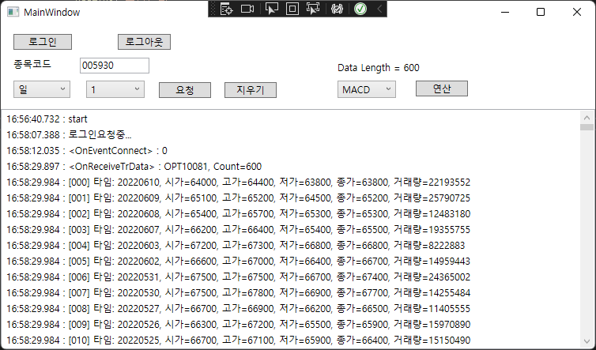

# Stock-learning

개발도구: VS2022, WPF, C#

Nuget: ta-lib

개발순서:
- 키움증권 OpenApi연결
- ta-lib연결
- 딥러닝 모듈 연결(미확정)
- 차트데이터 불러오기/ 지표연산
- 백테스팅
- 실시간 주문 연동

# 64비트 개발은 64비트ActiveX 설치 필요
https://github.com/terapark/64bit-kiwoom-openapi
